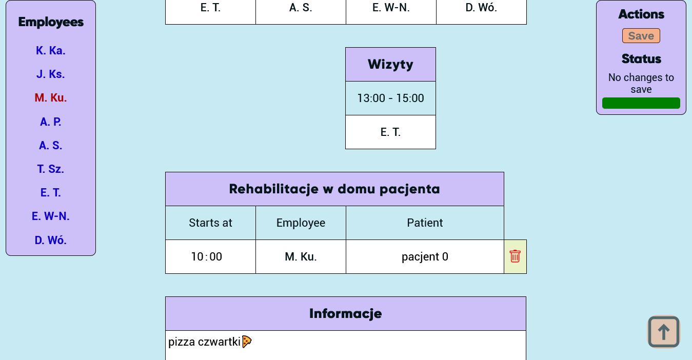
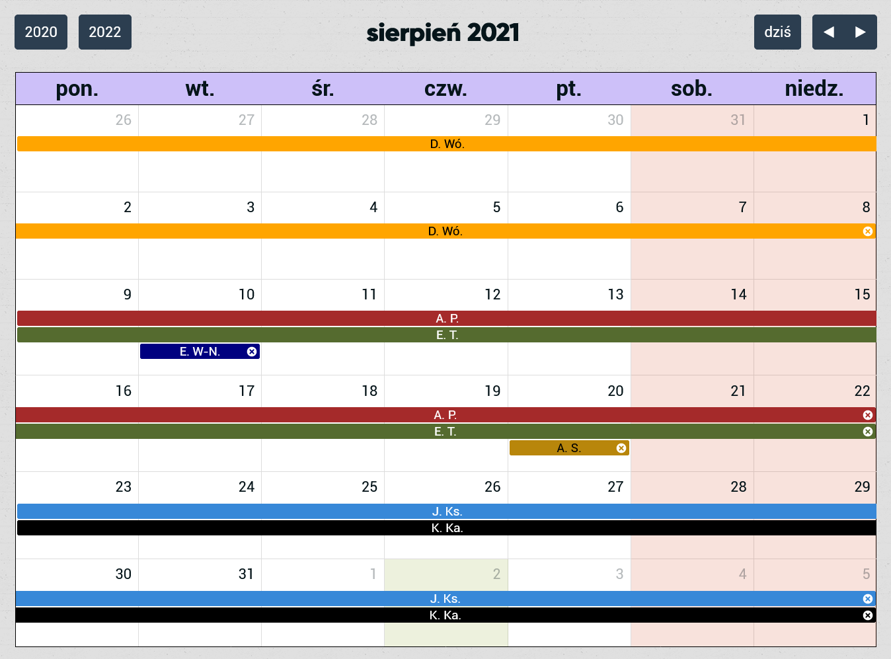
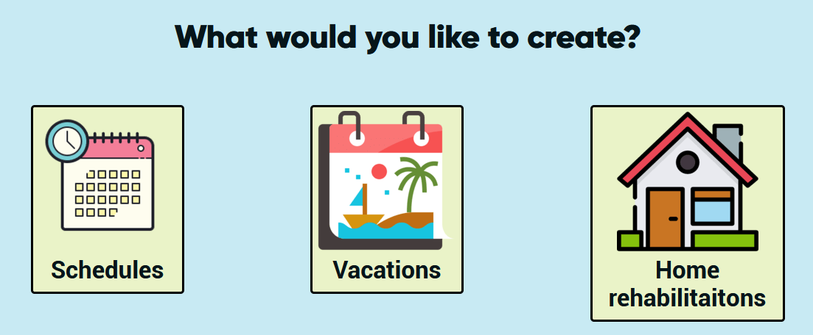
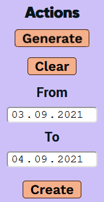
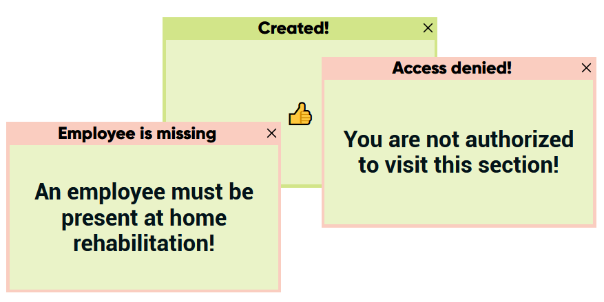

<h1 align="center">Medic Schedule Manager - client</h1>

&nbsp;

&nbsp;

&nbsp;

&nbsp;

&nbsp;

&nbsp;

> 
 Technology stack and tools used to build Medic Schedule Manager application. 

---

&nbsp;

> https://fizjo-medyk.swidnica.pl/

## Table of Contents

- [Introduction](#introduction)
- [View](#view)
  - [Schedules](#schedules)
  - [Vacations](#vacations)
- [Create](#create)
  - [Generator](#generator)
- [Winbox](#winbox)
- [Deployment](#deployment)

## Introduction

The goal of this application was to digitalize management of schedules at company i currently work at (private health care facility). Previously, schedules were created on papper which which unnecessarily took a lot of time for the manager. This application will **automate and simplify** the process of schedule creation nad employee management.
Only logged users are allowed to enter the service. An account has been created per each employee, manager has been granted permissions to edit content. Navigation is handled with [React Router](https://reactrouter.com/) library.

## View

### Schedules

This view consist of three parts: schedules, divided to four stations, a home rehabilitations view and a comment section. While normal employee can only view it, manager can modify the content. Employees can be moved by drag&drop system.

> Manager view of schedules allow to edit all parts of a daily plan.

### Vacations

Vacations are shown as a calendar with a month view by an external API
[Fullcalendar](https://fullcalendar.io/).

> Manager view of a calendar allow to resize, move and remove each vacation.

## Create

This section is available only to user with manager permissions. When topic of interest is selected a simple admin panel appears from where an instance of schedule/home rehabilitation/vacation can be made.

### Generator

During creation of this application, it was always clear what would it's main feature be - an automated schedule generator which will save a lot of time. In current version, 1.0, generator returns a fully composed daily schedule accordance with the general guidelines (an employee cant be at two diffent stations at the same time, can't work on two shifts, can't stay at "masaz" station twice a day and each "masaz" and "wizyty" station cell must be occupied etc.). After receiving proposed by generator schedule user can modify it with drag&drop system used in [view schedules section](#schedules).
**TODO**: further version of generator will ask user before generating a schedule for a list of employees available and compose a schedule for given crew.

## Winbox

Users recive feedback via [Winbox](https://github.com/nextapps-de/winbox) messages system. Winbox notifications appearance and behaviour is similar to Windows native messages.

## Deployment

Application is running on [Amazon EC2](https://aws.amazon.com/ec2/?ec2-whats-new.sort-by=item.additionalFields.postDateTime&ec2-whats-new.sort-order=desc) Linux instance (Ubuntu 20.04). SSL certificate is provided by Let's Encrypt.

---

> _Interested in my work? check out more at my [Github](https://github.com/Cararr) account or contact me at cararr@tlen.pl!_
